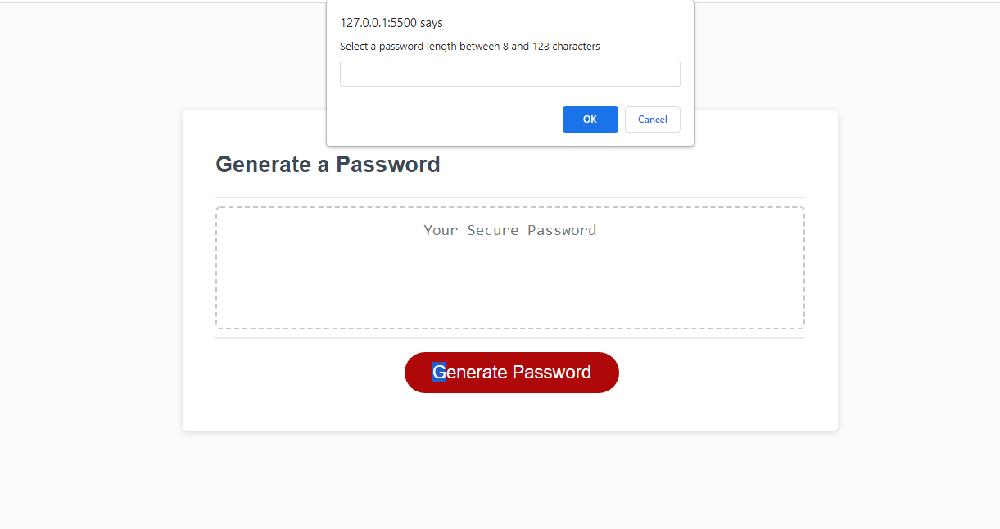

<h1 align="center">Password Randomizer</h1>

---

## 

- [About](#about)
- [Usage](#usage)
- [Built With](#built_using)
- [Authors](#authors)
- [Questions](#questions)
- [Screenshots](#screenshots)

## 

- This application is a password generator that will randomize a password for you based on the criteria chosen.

## 

- To use this application, load it up and follow the prompts to choose a length and other criteria allowed in the password, once you have finnished your password will be shown.

## 

- HTML
- CSS
- Javascript

## 

- [ileachy](https://github.com/ileachy)

## 

- For any questions please email me at ileach81@gmail.com or open and issue in github.

## 

